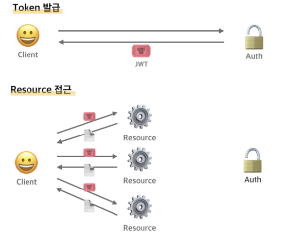

# JWT(Json Web Token), OAuth2
### 1) 서버 기반 인증 방식
* 서버 측에 유저 정보 저장하는 방식
* 대표적으로 세션을 이용하여 처리하는 방법
    * 사용자가 로그인 시 서버는 해당 유저의 세션을 만들고 서버의 메모리와 데이터베이스에 저장.
    * 사용자가 증가하여 서버를 확장하게 되면 모든 서버에게 세션의 정보를 공유해야하기에 별도의 중앙 세션 관리 서버를 만든다.

일반적으로 2개 이상의 서버를 운영할 때 세션 동기화 설정을 해주는 번거로움을 해결하기 위해 Redis와 같은 메모리 DB에 세션을 저장도로 사용하여 구현.

### 2) Access Token, Refresh Token
* Access Token
  * 리소스에 직접 접근할 수 있도록 해주는 정보만을 가지고 있다.
  * Refresh Token에 비해 짧은 만료 기간을 가지며, 주로 세션에 담아 관리.
* Refresh Token
  * 새로운 Access Token을 발급하기 위한 정보를 담고 있다.
  * 클라이언트가 Access Token이 없거나 만료되면 Refresh Token을 통해 Auth Server에 요청하여 새로운 Access Token을 발급 받을 수 있다.
  * 외부에 노출되지 않도록 관리를 위해 데이터베이스에 저장

### 3) OAuth 2.0
* 인증을 위한 표준 프로토콜
* 구글, 페이스북, 네이버 등에서 제공하는 Authorization Server를 통해 회원정보를 인증하고 Access Token을 발급받는다.
* 발급받은 Access Token을 사용해 타사의 API 서비스를 이용
* 서버는 API 호출 요청에 대해서 Token이 유효한지 확인할 필요가 있다.
  * 서버에서 클라이언트의 상태(토큰의 유효성)을 관리하게끔 한다
  * API를 호출할 때마다 그 토큰(Access Token)이 유효한지 매번 DB 등에서 조회하고 새로 갱신 시 업데이트 작업을 해주어야 한다

### 4) JWT
* 정보를 JSON 객체 형태로 주고받기 위해 표준 규약에 따라 생성한 암호화된 문자열(Token)이다.
* JWT는 Claim 기반이라는 방식을 사용
  * Claim: 사용자에 대한 프로퍼티 속성
    
        {
         "id:"test",
         "role":"user"
        }
  
  
  * JWT Token
    * 의미있는 토큰(유저의 상태를 포함한)으로 구성되어 있기 때문에 Auth 서버 쪽의 비용을 절감하면서 Stateless한 아키텍처를 구성할 수 있다.
    * Application Server가 더이상 로그인한 사용자의 session을 관리하지 않는다.
      * 전달받은 JWT가 유효한 Token인지만 확인
1. 클라이언트는 Auth Server에 로그인 시도.
2. Auth Server는 application server 내에 위치하거나 Google과 Naver과 같은 제 3자가 될 수도 있다.
3. Auth Server에서 인증을 완료한 사용자는 JWT Token을 전달받는다.
4. 클라이언트는 application server에 resource를 요청할 때 앞서 전달받은 JWT Token을 Authorization Header에 전달한다.
5. application server는 전달받은 JWT Token이 유효하면 200 ok와 함께 Data를 Response한다.
* JWT 장점
  * 확장성
    * 세션 이용 시
      * 서버를 스케일 아웃(확장)할 때마다 각 서버에 세션 정보를 저장.
      * 특정 서버에서 로그인 인증을 받을 때 사용자가 증가하여 다른 서버에서 스케일 아웃이 일어났을 때 다른 서버에서 로그인 했는지 알 수 없다는 단점이 있다.
        * A 사용자가 A 서버로부터 로그인 인증 받음
        * 사용자 증가로 B 서버에서 스케일 아웃
        * B 서버는 A 사용자가 로그인했는지 알 수 없음
    * JWT 이용 시
      * 서버가 늘어나도 토큰을 인증하는 방식만 알고 있다면 사용자 인증에 문제가 없다
      * JWT를 이용하지 않고 세션 전용 서버를 만들어 DB에 저장하는 방법도 있지만, 이 경우 사용자 인증이 필요한 API의 모든 요청에 대해서 서버에 조회를 해서 DB의 값을 읽어야 하므로 DB 부하를 만들 수 있다.
      * 웹-앱 간의 쿠키 세션 처리에 좋다.
        * 브라우저에서의 쿠키 처리 방법과 앱에서의 쿠키 처리 방법은 다르기 때문에 JWT를 이용하는 것이 다양한 디바이스 차원에서 좋다.
  * 보안성
    * 클라이언트가 서버로 요청할 때 쿠키를 전달하지 않기 때문에 쿠키를 사용함으로써 발생하는 취약점이 사라진다.
    * 서버 기반 인증 시스템의 문제인 CORS 문제 해결
      * 쿠키는 발행한 서버에서만 유효하다.
      * 즉, A에서 발행한 쿠키가 B에서 사용할 수 없다.
      * JWT는 어떠한 도메인에서도 토큰만 유효하다면 처리가 가능하다.
* JWT 단점
  * 모든 요청에 대해 토큰이 전송되기 때문에 데이터 증가하면서 따른 네트워크 부하가 증가할 수 있다.
  * 토큰 자체에 정보를 담고 있기 때문에 JWT가 만료되기 전에 탈취당하면 서버에서 처리할 수 있는 일이 없다.
  * JWT는 상태를 저장하지 않기 때문에 한번 만들어지면 제어가 불가능해진다.
    * 토큰을 임의로 삭제하는 것이 불가능하기 때문에 만료시간은 필수적으로 넣어주어야 한다.

